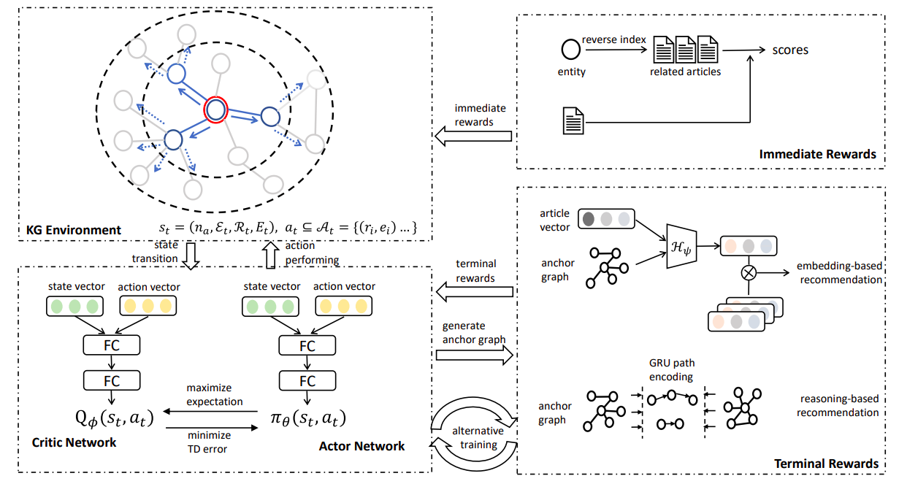

# Reinforced Anchor Knowledge Graph Generation for News Recommendation Reasoning

This repository contains the source code of the paper: Reinforced Anchor Knowledge Graph Generation for News Recommendation Reasoning

## Dataset:

The original data we used is from the public news dataset : [MIND](https://msnews.github.io). We build an item2item dataset based on the method in the paper.

Files in data folder:

-    `./data/`
     -   `kg/`
         - `kg.tsv: ` knowledge graph triples from Wikidata;
         - `entity2id.tsv` entity label to index;
         - `relation2id.tsv` relation label to index;
         - `entity2vec.vec` entity embedding from TransE;
         - `relation2vec.vec` relation embedding from TransE;
     -   `./mind/`
            - `doc_embedding.tsv: ` document embedding from sentence-bert;
            - `doc_entity.tsv` document \t entities
            - `train.tsv` item2item train data
            - `val.tsv` item2item val data
            - `test.tsv` item2item test data
            - `warmup_train.tsv` warm up training data
            - `warmup_test.tsv` warm up testing data

## Requeirements:

python = 3.6 
Pytorch = 1.4.0 
scikit-learn = 0.23.2 
numpy = 1.16.2 
hnswlib = 0.4.0 
networkx = 2.5

## How to run the code:

    $ python ./main.py --config config.yaml

we also offer a quick example running on MIND dataset: AnchorKG_example.ipynb
